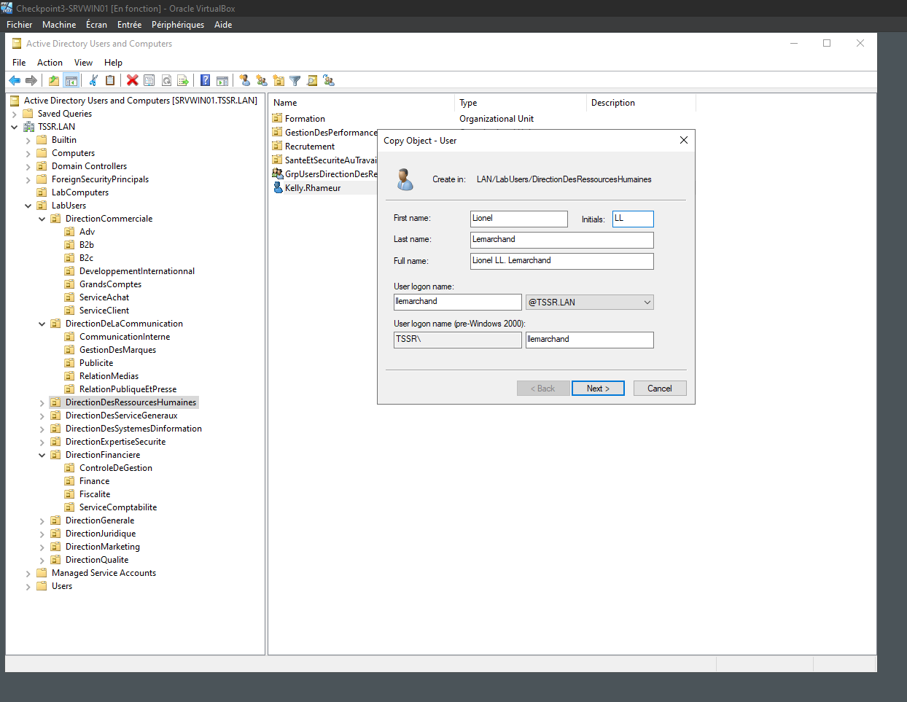
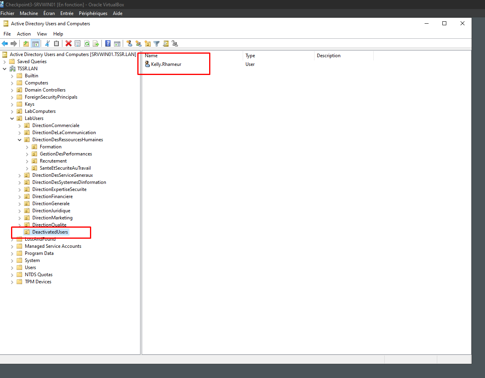
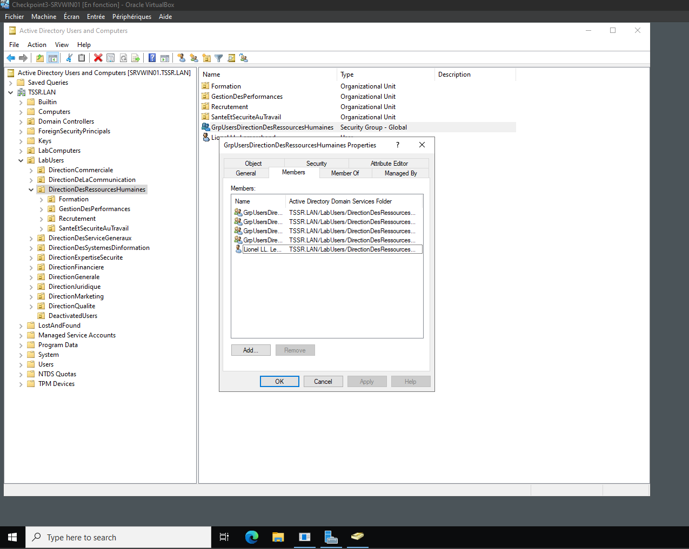
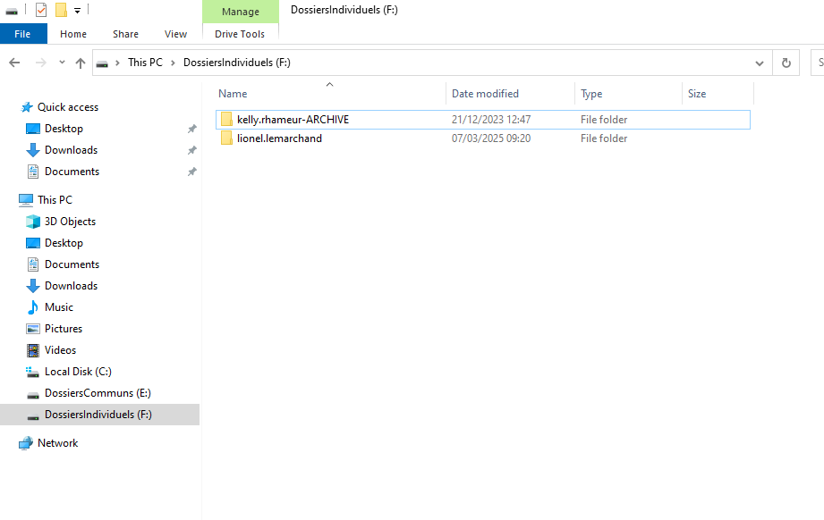
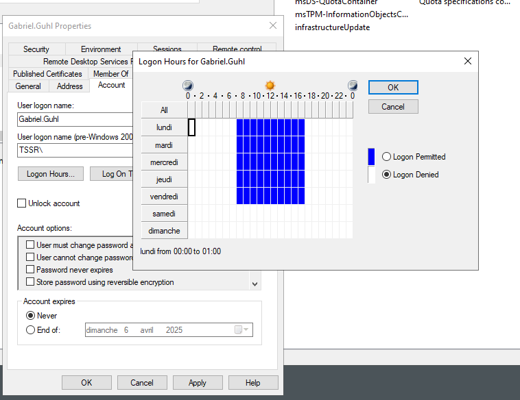
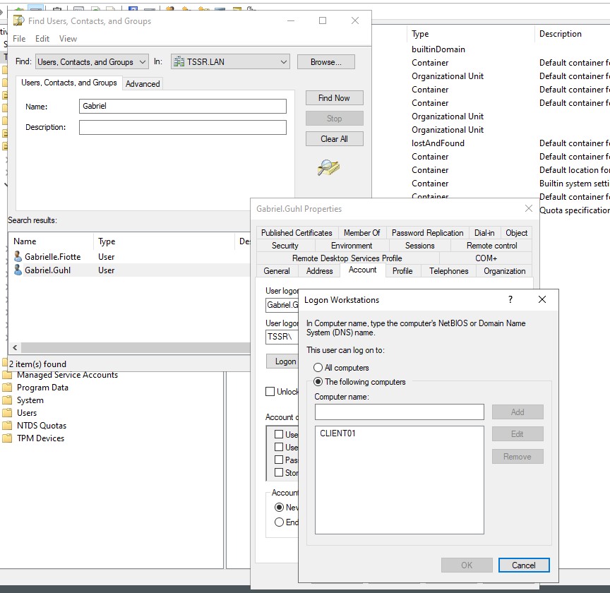
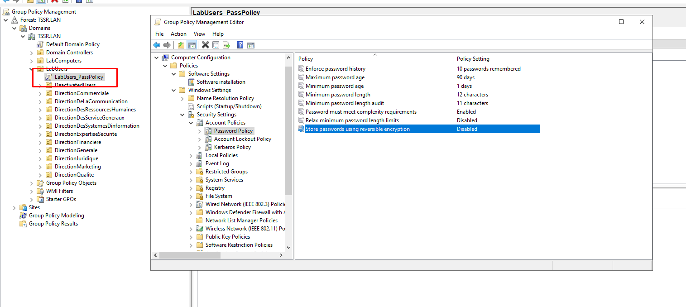
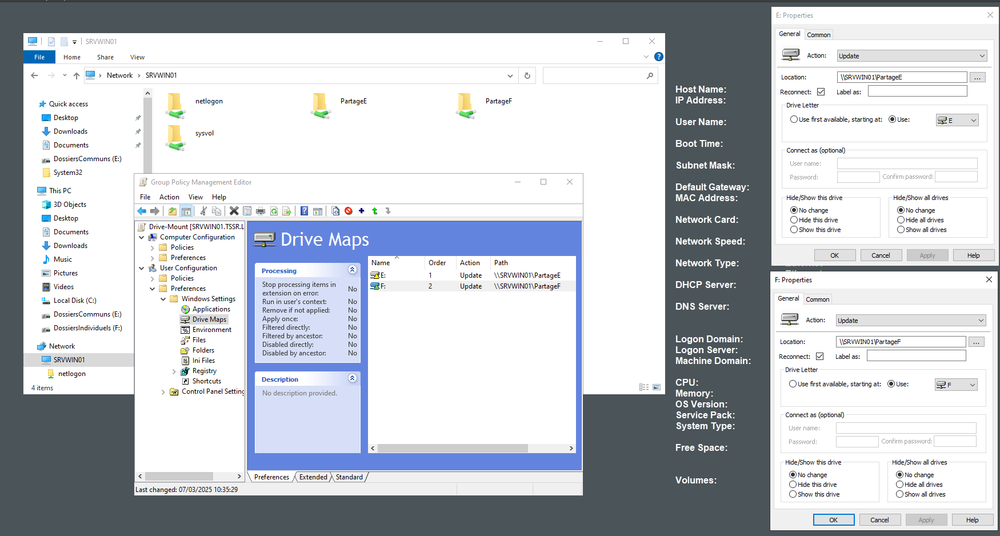
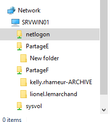

# Exercice 1 - VM Windows
## Partie 1 - Gestion des utilisateurs

### Q.1.1.1
J'ai cliqué sur TSSR mis le nom de Kelly Rhameur une fois que je l'ai trouvé j'ai copié les attributs de Kelly Rhameur pour crée l'utilisateur Lionel Lemarchand. Il dispose bien des mêmes attributs.

### Q.1.1.2
J'ai donc crée une OU DeactivatedUsers dans l'OU LabUsers et j'y ai glissé l'utilisateur Kelly Rhameur.

### Q.1.1.3
Je suis donc aller dans les propriétés de l'OU ou Kelly était encore présente et je l'ai retirer.

### Q.1.1.4
J'ai crée le dossier individuel pour le nouvel utilisateur "Lionel Lemarchand" et j'ai archivé celui de Kelly Rhameur en le renommant avec le suffixe "-ARCHIVE"

## Partie 2 - Restriction utilisateurs

### Q1.2.1
J'ai donc chercher l'utilisateur Gabriel Ghul dans l'AD, une fois trouver je suis aller dans properties, account, j'ai cliqué sur logon hours et j'ai attribué les bonnes heures demander.

### Q1.2.2
Toujours dans les properties de Gabriel Guhl j'ai cliqué sur le bouton à coter de Log on to et j'ai juste mis l'accès à l'ordinateur CLIENT01.

### Q1.2.3
Je suis aller dans Group Policy Management, dans l'OU LabUsers j'ai crée une gpo "LabUsers_PassPolicy" ensuite j'ai cliqué sur celle-ci "Edit" et ensuite je suis aller dans Password Policy (voir screen car c'est trop long si je mets tout les dossier que j'ai parcouru) et j'ai appliquer ma propre configuration pour les mot de passe que j'ai estimé sécurisé.

Modification:
- Enforce password history : 10 passwords remembered
- Max password age : 90 days
- Min password age: 1 days (si il a mit quelque chose qui ne trouvait pas sécurisé il peut le modifier ou pour autre raisons)
- Minimum password length : 12 characters (on peut mettre 14 si on veut ou +)
- Min password length audit: Enabled
- Et les deux autres options disabled

## Partie 3 - Lecteurs réseaux

### Q1.3.1
J'ai donc crée une GPO Drive-Mount, ensuite j'ai chercher le paramètre "Drive Maps" j'ai crée 2 mapped drive un avec le lecteur E et un autre avec le lecteur F

