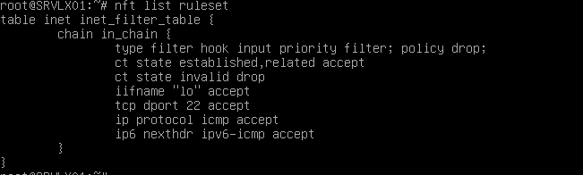

# Exercice 2 - VM Linux
## Partie 1 - Gestion des utilisateurs

### Q.2.1.1
J'ai donc crée l'utilisateur tom via la commande :
(Je suis en root de base donc pas besoin du sudo)

useradd -m -s /bin/bash tom (on défini le mdp cmd d'après)

passwd tom (et tu tapes 2 fois le mdp que tu veux définir)


### Q.2.1.2
Mot de passe sécurisé avec des caractères spéciaux et minimum de taille 13 14

Et ajouter l'utilisateur au groupe sudo pour éviter de devoir utiliser root pour tout


En l'occurence sudo est pas installé par défaut sur cette machine mais c'est une préconisation que je propose tout de même

## Partie 2 - Configuration de SSH

### Q.2.2.1
J'ai modifier le fichier config :

/etc/ssh/sshd_config
J'ai décommenter la ligne PermitRootLogin et j'ai ajouter un no à la placce de prohibit-password ça donne donc

PermitRootLogin no


### Q.2.2.2 :
Ici j'ai ajouter dans le fichier :

/etc/ssh/sshd_config (même fichier config que celui au dessus)

et j'ai ajouter la ligne AllowUsers tom


### Q.2.2.3 :
J'ai décommenter 2 lignes :

PasswordAuthentication no (désactivation de la connexion via le mdp)

PubKeyAuthentication yes (activation de connexion via les clés)


## Partie 3 - Analyse du stockage

### Q.2.3.1 :
Pour voir les systèmes de fichiers actuellement montés j'ai fais la commande : 

df -h

il y'a plusieurs tmpfs (4)

udev monté sur /dev

/dev/md0p1 monté sur /boot

voir screen pour plus de détails


### Q.2.3.2 :
Type de système de stockage qu'ils utilisent:

devtmpfs

tmpfs

ext4

ext2


### Q.2.3.3 :
J'ai donc ajouté un disque de 8gb via oracle virtualbox, ensuite je suis retourner sur la vm et je l'ai partitioner à l'aide de fdisk /dev/sdb

n (nouvelle partition) p (partition primaire) ensuite on laisse par défaut et après je définis le type de la partition avec t (type) et ensuite fd (linux raid) et w (pour écrire la partition et les modifications dessus)


Ensuite j'ai ajouté le nouveau disque au raid à l'aide la cmd

mdadm --add /dev/md0 /dev/sdb1

puis j'execute la commande :

mdadm --detail /dev/md0

pour regarder si la reconstruction est bonne et complète


(Aucune utilisation du sudo car je suis en root pour aller plus vite)

### Q.2.3.4
J'ai crée un groupe de volume avec la commande :

lvcreate -L 2G -n backup cp3-vg

Je la formate en ext4 :

mkfs.ext4 /dev/cp3-vg/backup

Je crée le répertoire bareos/storage :

mkdir -p /var/lib/bareos/storage

Je monte le volume :

mount /dev/cp3-vg/backup /var/lib/bareos/storage

Et ajouter la ligne suivante dans /etc/fstab :

/dev/cp3-vg/backup /var/lib/bareos/storage ext4 defaults 0 2

### Q.2.3.5
Nous pouvons voir qu'il reste 1.79 GB dans le volume


## Partie 4 - Sauvegarde

### Q.2.4.1

bareos-dir est le composant "main" du système de sauvegarde, il gère et planifie les sauvegardes

bareos-sd permet d'enregistrer et conserver les fichiers sauvegardés

bareos-fd nous permet d'envoyer des fichiers sauvegarder et aussi permet la restauration 

## Partie 5 - Filtrage et analyse réseau

### Q.2.5.1
Les règles appliquées sur Netfilter sont:

```
ct state established,related accept
ct state invalid drop
iifname "lo" accept
tcp dport 22 accept
ip protocol icmp accept
ip6 nexthdr ipv6-icmp accept
```
### Q.2.5.2
Les types de communications autorisées sont :

```
ct state established,related accept
iifname "lo" accept
tcp dport 22 accept
ip protocol icmp accept
ip6 nexthdr ipv6-icmp accept
```

### Q.2.5.3
Et la règle interdit (il y'en a qu'une) est :
```
ct state invalid drop
``` 

Image pour Q2.5.1,2,3 :



### Q.2.5.4
(A l'aide d'internet)

Ne pas oublie de check si nftables est activé et si il est pas activé de l'activé !

systemctl enable nftables

systemctl start nftables

Voici les deux règles nécessaires pour que bareos communique avec les clients :

nft add rule inet filter input ip saddr 192.168.1.0/24 tcp dport {9101, 9102, 9103} accept

nft add rule inet filter output ip daddr 192.168.1.0/24 tcp sport {9101, 9102, 9103} accept


## Partie 6 - Analyse de logs

### Q.2.6.1

Pour afficher les logs d'échecs de connexion j'ai fais:

grep "Failed password" | cat /var/log/auth.log | tail -n 10 > logg.txt


